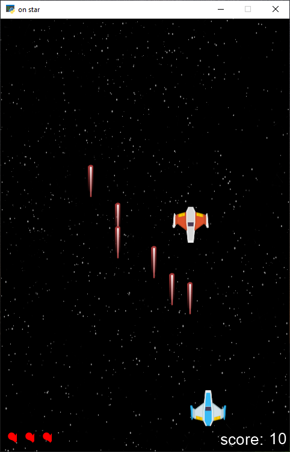

# Space Defender Game

A simple space defender game built using the Arcade library in Python.

## Screenshots



## How to Play

1. **Controls:**
   - Move the spaceship: Right arrow or 'D' key for right, Left arrow or 'A' key for left.
   - Shoot: Spacebar.

2. **Objective:**
   - Defend your spaceship against incoming enemies.
   - Earn points by shooting down enemies.
   - Avoid collisions with enemies.

3. **Scoring:**
   - Each enemy shot down earns you a point.
   - The game ends if your spaceship collides with an enemy or if your heart count reaches zero.

## Prerequisites

Make sure you have Python and the Arcade library installed.

```bash
pip install arcade
```

### How to Run

Clone the repository and run the game.py file.

```bash
python game.py
```

Dependencies
Arcade Library
Sound Credits

- Laser sound: [Link to the source](https://api.arcade.academy/en/latest/resources.html)
- Explosion sound: [Link to the source](https://api.arcade.academy/en/latest/resources.html)

Acknowledgments
Special thanks to the Arcade library for making game development in Python accessible.
