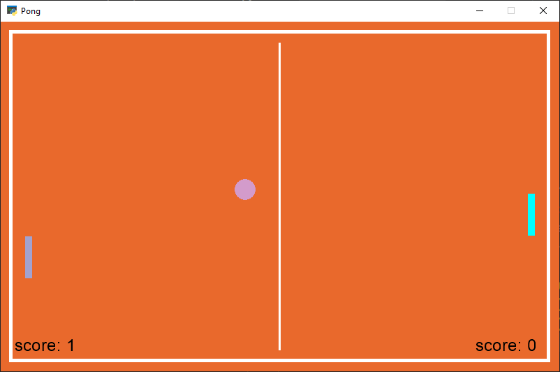
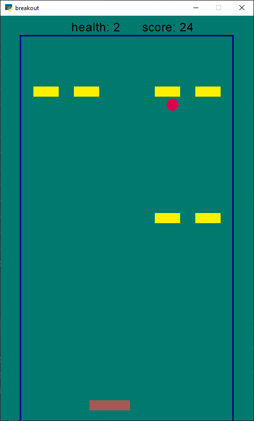

# Pong and Breakout Games

## Pong

### Overview

Pong is a classic two-player arcade game where players control paddles to hit a ball back and forth. The goal is to score points by making the ball pass the opponent's paddle.

### Instructions

- Player 1 (Blue Paddle): Move up and down using mouse motion.
- Player 2 (Aqua Paddle): AI-controlled opponent.

### Controls

- Mouse Motion: Control the movement of Player 1's paddle.

### How to Play

- Run the pong.py file.
- Use mouse motion to control Player 1's paddle.
- Player 2 is an AI-controlled opponent.
- Score points by making the ball pass Player 2's paddle.

### Screenshots

## Breakout

### Overview

Breakout is a classic arcade game where players control a paddle to bounce a ball and break blocks. The objective is to clear all the blocks while keeping the ball in play.

#### Instructions

- Player (Rocket): Move left and right using the A and D keys or the left and right arrow keys.
- Ball: Bounce off the paddle to break blocks.

##### Controls

- A or Left Arrow: Move the paddle left.
- D or Right Arrow: Move the paddle right.

### How to Play

- Run the breakout.py file.
- Use the A and D keys or left and right arrow keys to control the paddle.
- Bounce the ball off the paddle to break the yellow blocks.
- Score points for each block broken.
- The game ends when the player runs out of health.

#### Game Over

- When the player runs out of health, the game displays "GAME OVER."

## Screenshots

