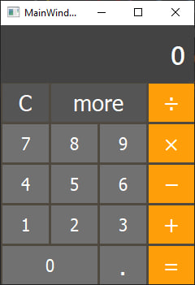
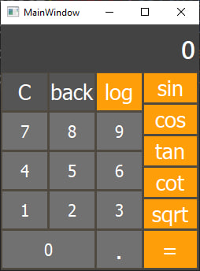

# Calculator App

This is a simple calculator application with additional mathematical functions. The application has two windows: the main window and the advanced functions window.

## Calculator Class

### Attributes

- `current_text`: Holds the current input text.
- `first_number`: Holds the first number for binary operations.
- `operation`: Holds the current operation.

### Methods

- `append_number(number)`: Appends a number to the current input text.
- `set_operation(opr)`: Sets the binary operation.
- `choice_operation()`: Performs the selected binary operation.
- `append_number_another_window(number)`: Appends a number in the advanced functions window.
- `set_operation_more_window(opr)`: Sets the operation for advanced functions.
- `more_Mathematics()`: Performs advanced mathematical operations.
- `open_another_window()`: Closes the main window and opens the advanced functions window.
- `open_main_window()`: Closes the advanced functions window and opens the main window.
- `clear()`: Resets the calculator to its initial state.

## Usage

1. Open the main window.
2. Use the number buttons, dot button, and binary operation buttons for basic calculations.
3. Click the "More" button to access advanced functions.
4. Perform advanced functions such as sin, cos, tan, cot, log, and sqrt.
5. Click "Back" to return to the main window.

## Screenshots

## Dependencies

- `PySide6`: Python bindings for Qt.
- `mpmath`: Library for arbitrary-precision arithmetic.
- `Decimal`: Library for decimal floating-point arithmetic.

Feel free to ask if you have any questions or encounter issues!
