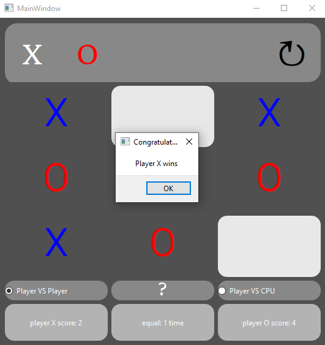
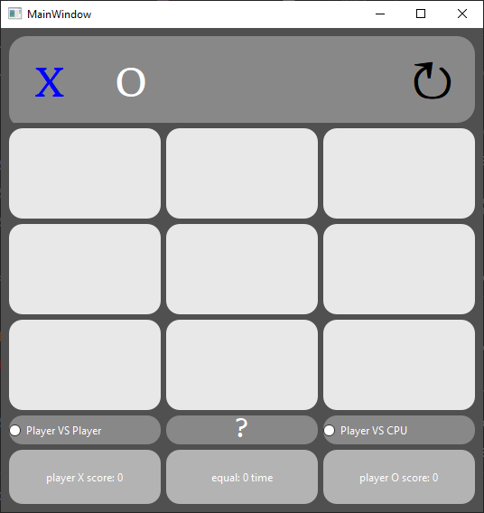

# Tic-Tac-Toe Game

## Overview

The Tic-Tac-Toe game implemented in this code is a classic two-player game where participants take turns marking 'X' or 'O' on a 3x3 grid. The goal is to achieve a row, column, or diagonal of three of their marks before the opponent does.

## Game Modes

### Player vs. Player (PvP)

In this mode, two human players compete against each other. They take turns making their moves, marking the grid with 'X' or 'O' to win the game.

### Player vs. Computer (PvC)

This mode allows a single player to face off against the computer. The player marks 'X,' and the computer responds with 'O.' The challenge is to outsmart the computer and win the game.

## User Interface

The game features a user-friendly interface with a 3x3 grid of buttons representing the game board. Players can click on the buttons to make their moves. The current player's turn is indicated, and scores are displayed for both players.

## How to Play

1. **Select Game Mode:**
   - Choose between Player vs. Player (PvP) or Player vs. Computer (PvC) before starting the game.

2. **Make Moves:**
   - In PvP mode, two players take turns marking the grid.
   - In PvC mode, the human player marks 'X,' and the computer responds with 'O.'

3. **Winning the Game:**
   - A player wins by having three of their marks in a row, column, or diagonal.
   - The game ends when a player wins or when all nine grid spaces are filled.

4. **Game Controls:**
   - **Reload:** Start a new game by resetting the board and scores.
   - **About:** Learn more about the game and its rules.

## Scoring

Players' scores are tracked for both Player X and Player O. Additionally, there is a count of ties when the game results in a draw.

## Dependencies

- `PySide6`: Python bindings for Qt.

Feel free to ask if you have any questions or encounter issues!
