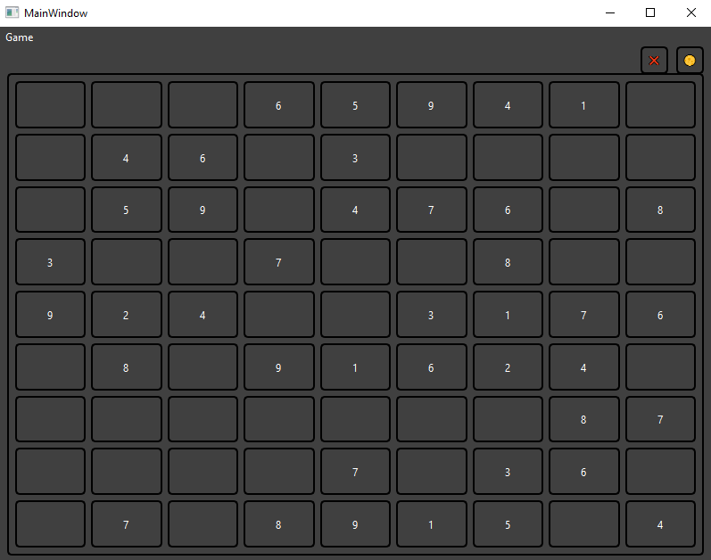
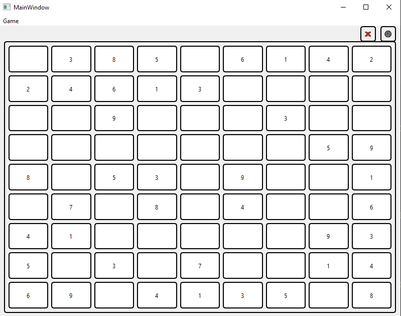

# Sudoku Game with PySide6

## Description

This program is a simple Sudoku game with a graphical user interface, built using PySide6 and Python.

## Screenshot




## Features

- Create new game
- Auto-solve Sudoku
- Load game from text file
- Dark mode
- User input validation
- Win message

## How to Play

- Run the program.
- Click the "New Game" button to start a new game.
- Click the "Solve" button to automatically solve the Sudoku.
- Click the "Open File" button to load a game from a text file.
- Click the "Theme Toggle" button to switch between light and dark mode.
- Enter numbers in the empty cells of the game board.
- The program automatically validates your input and highlights it in red if it's invalid.
- Win the game by filling all empty cells with valid numbers.

## Requirements

- Python 3.11
- PySide6

## Installation

 ```python
 pip install pyside6
 ```

## Run

`
python main.py
`

### Notes

This program is under development and may contain bugs.
Refer to the source code for more information.
License:

This program is released under the MIT license.

## Contributions

You can contribute to the development of this program by submitting Pull Requests to the GitHub repository.

Thank you for using this program!
