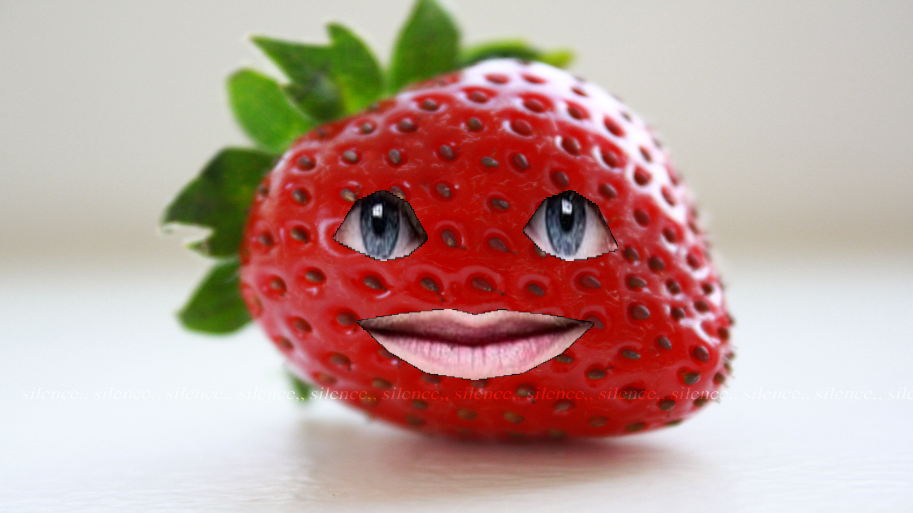
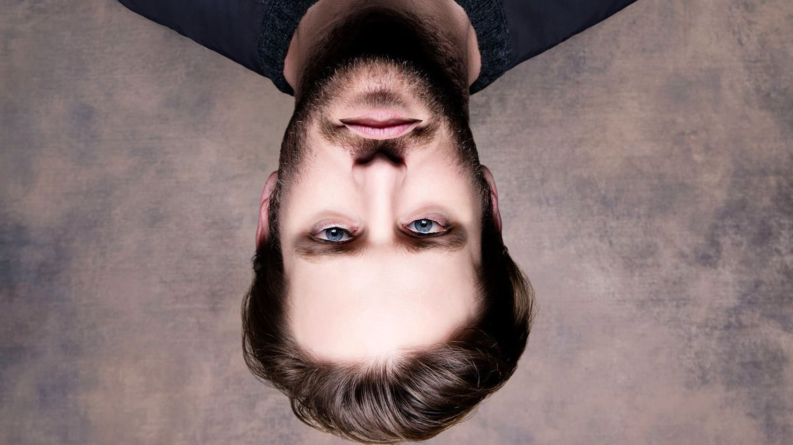
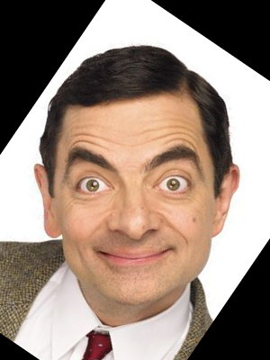
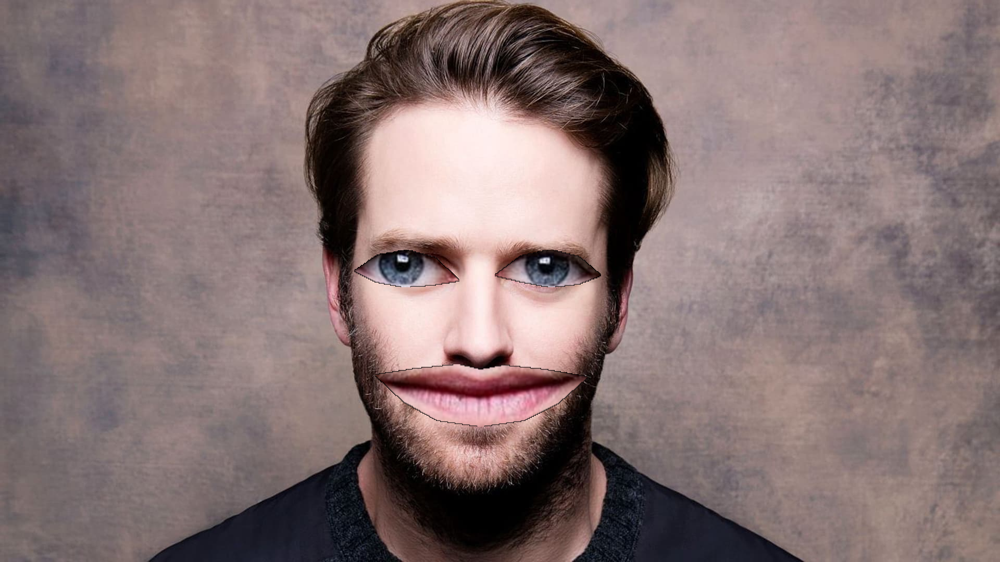

# Project Title

## Table of Contents

- [About](#about)
- [Getting Started](#getting_started)
- [Usage](#usage)

## About <a name = "about"></a>

in this project we have fruit filter and big lips and eyes filter align face and rotate face without rotate eyes and lips.

### Screen_shot

#### Fruit Filter



#### Rotation Image



#### Aligned Image



#### Zoom Filter



## Getting Started <a name = "getting_started"></a>

### Installing

First of all you need install requirements library copy this code and run in terminal.

``` terminal
pip install -r requirements.txt
```

## Usage <a name = "usage"></a>

After you install requirements library you can choice between four project and run it with this code.

### fruit_filter

``` terminal
python fruit_filter.py
```

### rotation_photo

``` terminal
python rotation_photo.py
```

### align_face

``` terminal
python align_face.py
```

### zoom_filter

``` terminal
python zoom_filter.py
```
