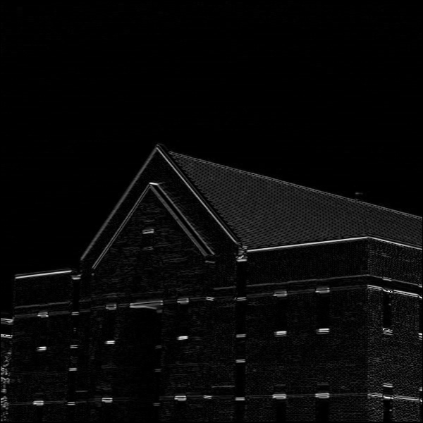

# Project Title

## Table of Contents

- [About](#about)
- [Getting Started](#getting_started)
- [Usage](#usage)

## About <a name = "about"></a>

in this project i made a histogram maker, noise redactor,foreground focus, edge detection and side edge detection.

### Output

#### Histogram

plot histogram


hist histogram


bar histogram


#### Foreground Focus


#### Edge Detector


#### Side Edge Detector

horizontal edge



vertical edge


#### Noise Redactor

3x3 noise redacted


5x5 noise redacted


15x15 noise redacted


## Getting Started <a name = "getting_started"></a>

### Installing

First of all you need install requirements library copy this code and run in terminal.

``` terminal
pip install -r requirements.txt
```

## Usage <a name = "usage"></a>

After you install requirements library you can choice between the projects and run it.

### histogram

``` terminal
python histogram.py
```

### foreground focus

``` terminal
python foreground_focus.py
```

### edge detection

``` terminal
python edge_detection.py
```

### side edge detection

``` terminal
python side_edge_detection.py
```

### noise redactor

``` terminal
python noise_redactor.py
```
