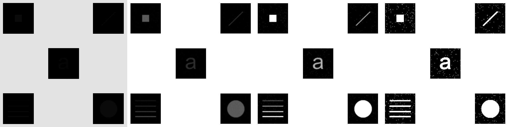
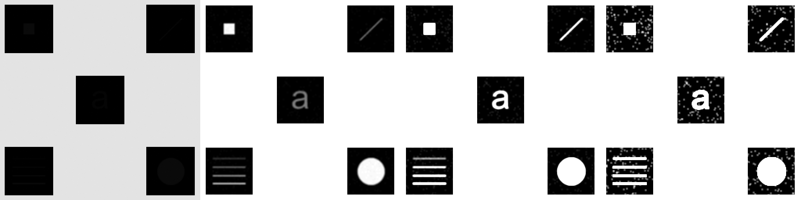
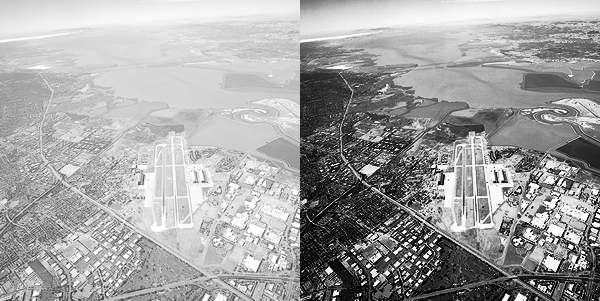

# Project Title

## Table of Contents

- [About](#about)
- [Getting Started](#getting_started)
- [Usage](#usage)

## About <a name = "about"></a>

in this project i made a histogram equalizer normal and clahe, reveal hidden item,2d convolution, median noise redactor.

### Output

#### 2D Convolution

| filter | input image | output image |
|--------------|-----------|-----------|
| sharpening filter |  |  |
| emboss filter |  |  |
| edge filter |  |  |
| black zone filter |  |  |

#### Item Reveal

average item reveal filter 3x3


average item reveal filter 5x5


#### Histogram Equalizer

| equalizer | input image VS output image |
|--------------|-----------|
| normal equalizer |  |
| normal equalizer |  |
| clahe equalizer |  |

#### Median Noise Redactor

|image name | input image | output image |
|--------------|-----------|-----------|
| image A |  |  |
| image board |  |  |
| image circle |  |  |
| image man woman |  |  |
| image skeleton |  |  |
| image woman |  |  |

## Getting Started <a name = "getting_started"></a>

### Installing

First of all you need install requirements library copy this code and run in terminal.

``` terminal
pip install -r requirements.txt
```

## Usage <a name = "usage"></a>

After you install requirements library you can choice between the projects and run it.

### 2d_convolution

``` terminal
python 2d_convolution.ipynb
```

### average reveal

``` terminal
python average_reveal.ipynb
```

### histogram equalizer

``` terminal
python histogram_equalizer.ipynb
```

### median noise redactor

``` terminal
python median_noise_redactor.ipynb
```
