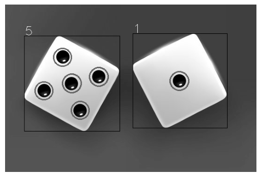

# Project Title

## Table of Contents

- [About](#about)
- [Getting Started](#getting_started)
- [Usage](#usage)

## About <a name = "about"></a>

in this section i code three opencv function from scratch, a dice counter and a funny filter.

### Output

#### dice counter



#### funny filter


## Getting Started <a name = "getting_started"></a>

### Installing

First of all you need install requirements library copy this code and run in terminal.

``` terminal
pip install -r requirements.txt
```

## Usage <a name = "usage"></a>

After you install requirements library you can choice between the projects and run it.

### bounding rect

``` terminal
jupyter nbconvert --to script boundingrect.ipynb
```

### contour area

``` terminal
jupyter nbconvert --to script contourarea.ipynb
```

### dice counter

``` terminal
jupyter nbconvert --to script dice_counter.ipynb
```

### find contours

``` terminal
jupyter nbconvert --to script findcontours.ipynb
```

### funny filter

``` terminal
jupyter nbconvert --to script funny_webcam_filter.ipynb
```
