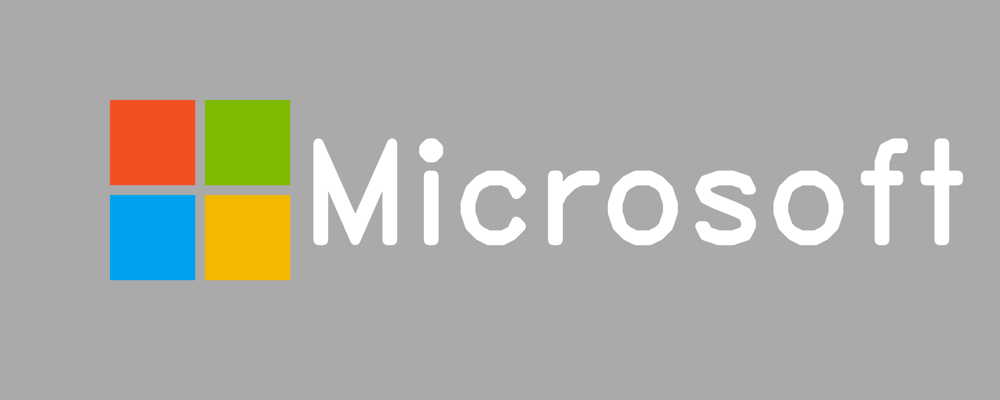

# Project Title

## Table of Contents

- [About](#about)
- [Getting Started](#getting_started)
- [Usage](#usage)

## About <a name = "about"></a>

in this section i code one opencv function from scratch, a mater welon, design microsoft logo, draw a rainbow and rubik solver.

### Output

#### mater welon


#### microsoft logo



#### rainbow


#### solved rubik


#### gray image


## Getting Started <a name = "getting_started"></a>

### Installing

First of all you need install requirements library copy this code and run in terminal.

``` terminal
pip install -r requirements.txt
```

## Usage <a name = "usage"></a>

After you install requirements library you can choice between the projects and run it.

### convert bgr to gray

``` terminal
jupyter nbconvert --to script bgr_to_gray.ipynb
```

### mater welon

``` terminal
jupyter nbconvert --to script mater_welon.ipynb
```

### microsoft logo

``` terminal
jupyter nbconvert --to script microsoft_logo.ipynb
```

### rainbow

``` terminal
jupyter nbconvert --to script rainbow.ipynb
```

### rubik cube solver

``` terminal
jupyter nbconvert --to script rubik_cube_solver.ipynb
```
