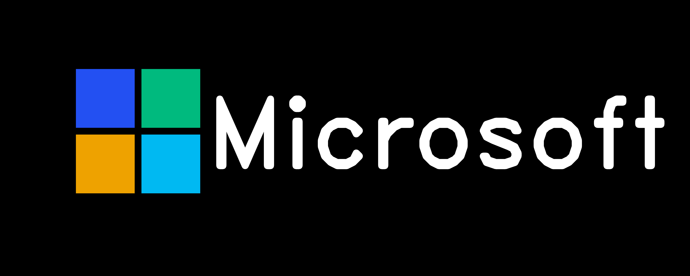
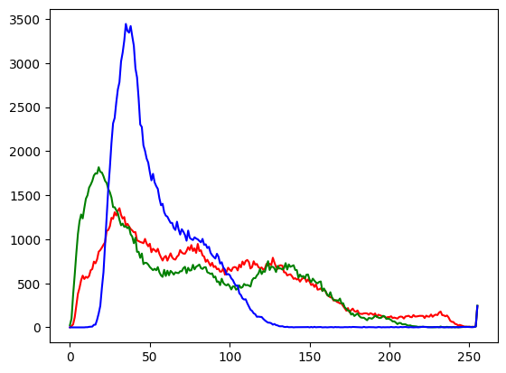
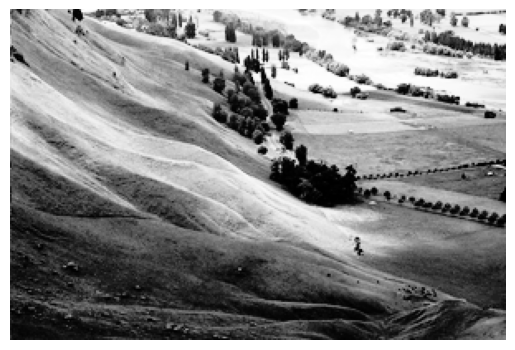
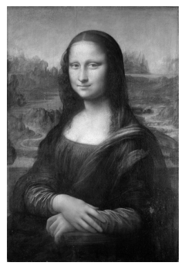
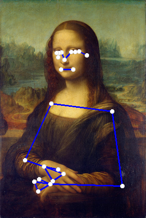

# Project Title

## Table of Contents

- [About](#about)
- [Getting Started](#getting_started)
- [Usage](#usage)

## About <a name = "about"></a>

in this section i did some exercise with pillow(PIL) and use mediapipe for find pose detection and find a way for enc/dec image and a simple color detection then i remove background image.

### Output

#### decoder encoder app

| title | image |
|--------------|-----------|
| input image |  |
| encoded image |  |
| output image |  |

#### remove background microsoft logo



#### pillow(PIL)

| title | image |
|--------------|-----------|
| persian text image |  |
| calc histogram image |  |
| equalize land image |  |
| gray monalisa |  |

#### pose landmark



## Getting Started <a name = "getting_started"></a>

### Installing

First of all you need install requirements library copy this code and run in terminal.

``` terminal
pip install -r requirements.txt
```

## Usage <a name = "usage"></a>

After you install requirements library you can choice between the projects and run it.

### decoder/encoder app

``` terminal
python enc_and_dec_image/app.py
```

### color detection

``` terminal
jupyter nbconvert --to script color_detection.ipynb
```

### pillow(PIL) exercise

``` terminal
jupyter nbconvert --to script PIL.ipynb
```

### pos landmark detection

> **use python 3.10**

``` terminal
jupyter nbconvert --to script pos_landmark.ipynb
```

### remove background

``` terminal
jupyter nbconvert --to script remove_background.ipynb
```
